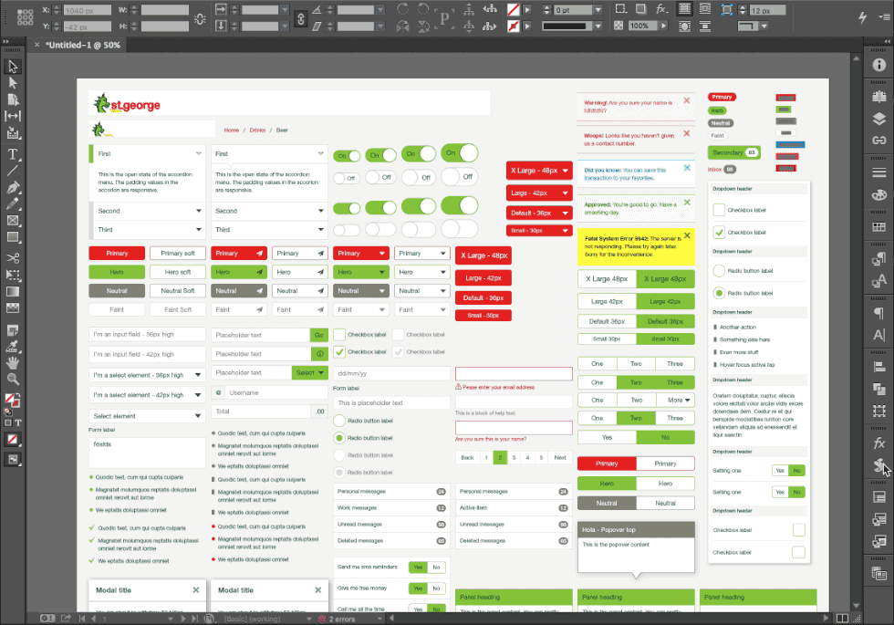
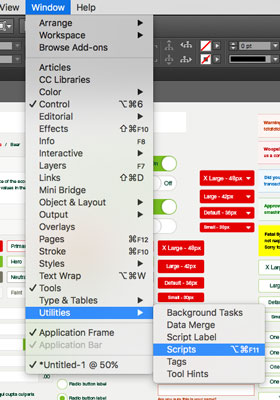

Visual Starter-Pack
===================

> Adobe InDesign integration for automatic brand changes.

### Content

* [General](#general)
* [How to use](#how-to-use)
* [Release History](#release-history)
* [License](#license)

----------------------------------------------------------------------------------------------------------------------------------------------------------------

### General

> Why do we need this?

Well the design process for several brands can be cumbersome as you have to test each of your designs in all brands. The
[Westpac GUI Starter-Pack](https://gel.westpacgroup.com.au/downloads/visual-design/gui-starter-pack.zip) makes it easy to use the elements we have in
[The GUI](https://gel.westpacgroup.com.au/GUI/) but rebranding can be a pain. Supported by a solid design system we have the ability to automate the process.

**[⬆ back to top](#content)**

----------------------------------------------------------------------------------------------------------------------------------------------------------------

### How to use

To install please download the script from [the BrandChange.js file](https://raw.githubusercontent.com/WestpacCXTeam/Visual-Starter-Pack/master/BrandChange.js)
and place it in your
Adobe InDesign script folder (typically somewhere around: `/Users/[you]/Library/Preferences/Adobe InDesign/Version 11.0/en_US/Scripts/Scripts Panel/`).

Once Adobe InDesign is open have a look at your Script panel found under: `Window ➤ Utilities ➤ Script`.

Run the Script by doubleclicking the `BrandChange` entrie in the `User` tab.

Make sure you have the [Westpac GUI Starter-Pack](https://gel.westpacgroup.com.au/downloads/visual-design/gui-starter-pack.zip) downloaded and unzipped as you
will be asked to locate it.

If you have questions please let us know in [the issues](https://github.com/WestpacCXTeam/Visual-Starter-Pack/issues).

**[⬆ back to top](#content)**

----------------------------------------------------------------------------------------------------------------------------------------------------------------

### Release History remote

* v0.1.1 - Fixed brand guessing and added fallback
* v0.1.0 - Initial setup

**[⬆ back to top](#content)**

----------------------------------------------------------------------------------------------------------------------------------------------------------------

### License

Copyright (c) Westpac. Licensed under the [GNU GPLv3](https://raw.githubusercontent.com/WestpacCXTeam/Visual-Starter-Pack/master/LICENSE).

**[⬆ back to top](#content)**

# };